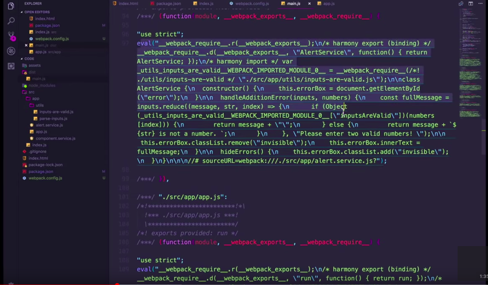
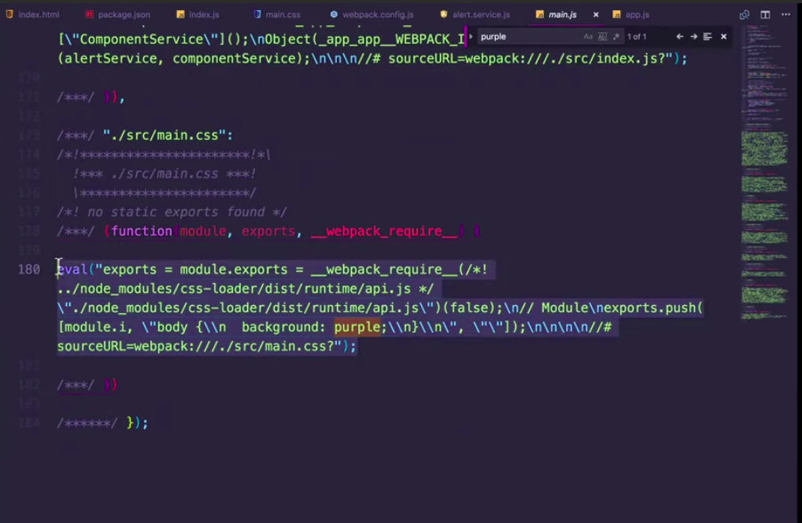
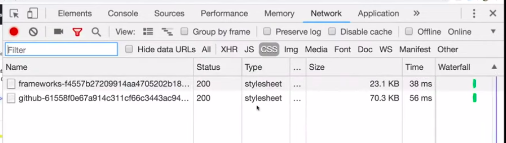
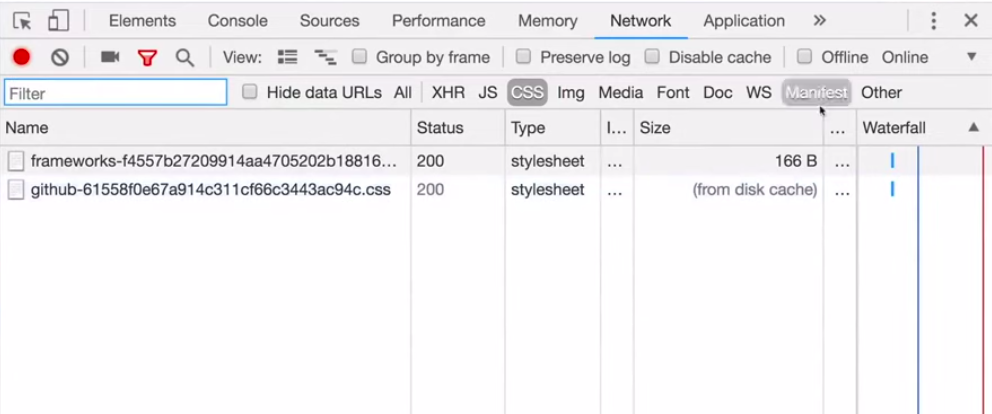
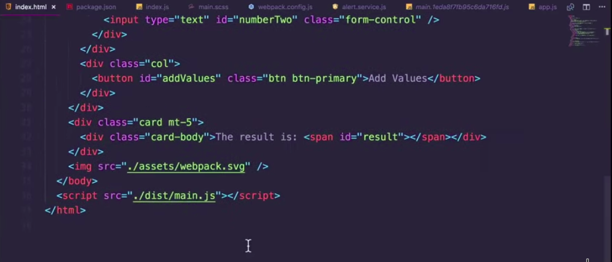

# Webpack 4, and video tutorial used is **Learn Webpack from Freecodecamp**

## cideo Url https://www.youtube.com/watch?v=MpGLUVbqoYQ

## set mode

`mode:'development '` or `mode:`production``

## `Eval` may be evil some time.

By default webpack use `eval(....)` everhwere in their produced bundle file,
Image before setting `devtool:"none"`

which you can turn off by setting

```
devtool: "none"
```

## Bare minimum file structure of a webpack config `weback.config.js`

````
const path=require("path");
module.export={
mode:"development",
entry:"./src/app.js",
output:{
filename:"main.js",
path:path.resolve(__dirname,'dist')
}

}```

This is the bare minimum you should be having by the way
````

## Loaders

Webpack primarily understands only JS, **Loaders** are something which makes webpack understand anything other thans JS well.

For example: webpack loaders can help, webpack understand `CSS` or `scss` or `svg` or literality anything which u use as part of your front end dev lify cycle.

basic sysntax for loaders in `Webpack` goes like this

```
module.export={
    //other basic stuff
    modules:{
        rules:[
            {
                test: / some regEx here/,
                use: ["<Loader name>"]
            }
        ]
    }
}

For Example:
modules:{
    rules:[
        {
            test:/\.css$/,
            use:["css-loader"]
        }
    ]
}
```

**NOTE: Loaders are parsed used from Right to Left order**

> Ok usally what loaders do?
> Since, Webpack only understand JS, so any loaders, what they will do is, they first write or convert whatever resource(say css) u need, into JS and add them in your webpack bundle file (main.js in this case).

Take one example, say you have one css file called `app.css` to use this file, you need some kind of webpack loader, which can make webpack understand css or u can say which write your css in some sort of valid JS into your webpack bundle file(main.js).

Here u can use `css-loader`, what css loader will do is actuyally it will take your css and it will add that into your main.js file.

**Say u have `app.css` file wil some thing like this**

```
//app.css
body{

    background:purple;
}

```

now `css-loader` will take that css and it will do something this in your `main.js` file


Thats is complete js, and its not going to change background of your `body tag`
to make that really work, you need something which can extract js part from `main.js` and add that to your dom or extract in some file add a link to that in your html file.

to achieve that you need `style-loader`,

Follow beloww steps:

1. install style loader `npm install style-loader -D`
2. then do like this
   ```
   module.export={
       //...
       module:{
           rules:[
               test:/\.css$/,
               use:["style-loader","css-loader"]
           ]
       }
   }
   ```
3. import your style in your `app.js` file like below
   ```
   import "./css/app.css"
   //other stuff
   ```
4. run your webpack like `npm run start`

## sass support in webpack

Same you can do for sass/scss file as well, you need to have a `sass-loader` and you are good to go.

```
   module.export={
       //...
       module:{
           rules:[
               test:/\.css$/,
               use:[
                   "style-loader", // this will extract that css from main.js and add that to your dom in style tag
                   "css-loader", // this will convert your css file to common js and will it to main.js
                   "sass-loader" // this will convert your scss file to css
                   ]
           ]
       }
   }
```

## cache busting and Plugins

Browsers caches statuc resources like css, js and images etc. this can be problematic and browser may not download the asked resources from server but rather server from the disk cache.

To test it, press `CTRL+ R` in your in network tab of your browser(chrome) it will download your css(say).

Then try to do do normal referesh, as you do in browser, you see something like this


now do a normal referesh and you will see that file is serverd from hard disk cache instead

 see the Size tab in both the images.

To prevent this probblem, webpack use cocenpt of `content based hash` . In this it add the has of the content to the file name of produced assests/chunks.

you can do like this `main.[contentHash].js`

```
const path=require("path");
module.export={
mode:"development",
entry:"./src/app.js",
output:{
filename:"main.[contentHash].js",
path:path.resolve(__dirname,'dist')
}

}
```

but now you will have problem because of dynamic file name,whenever you change the content of your file, it will create new hash `main.<somehash>.js`, so can not directly include that in your `index.html` like this.

earlier `index.html` without `contentHash`



To handle this problem, now u are not going to include that `main.js` by your self in your `index.html` file. rather you will let the webpack plugin do that for you.
so now you are finally at plugin

## webpack plugins

webpack plugins understands JS, and it actually customizes Webpack build process by various ways. For example adding this script in your `index.html` for you, instead of you doing this by your self.
There are tons of plugins available at [Webpack plugins , click here](https://webpack.js.org/plugins/)

> Bur for our purpose here, HtmlWebpackPlugin will do the job

so lets install this plugin and use it.

1. Install HtmlWebpackPlugin like `npm install --save-dev html-webpack-plugin`
2. require this in `webpack.config.js` like this

```
var HtmlWebpackPlugin = require('html-webpack-plugin');
var path = require('path');

module.exports = {
  entry: 'index.js',
  output: {
    path: path.resolve(__dirname, './dist'),
    filename: 'main.[contentHash].js'
  },
  plugins: [new HtmlWebpackPlugin()]
};
```

3. finally run your webpack.

But sometime you need to provide your own html for template for some reasons like if you are using some sort of Framework like Bootstrap, Bulma etc. in that you can provide that html template and `HtmlWebpackPlugin` will include that code as part of the html it generates . To do that you need to modify the plugins a bit. so

1. create your html template like `template.html`, you can name it anything

```
src/template.html
//.....
//....

```

2.

```
var HtmlWebpackPlugin = require('html-webpack-plugin');
var path = require('path');

module.exports = {
  entry: 'index.js',
  output: {
    path: path.resolve(__dirname, './dist'),
    filename: 'main.[contentHash].js'
  },
  plugins: [new HtmlWebpackPlugin({
      template:"./src/template.html"
  })]
};
```

3. run your webpack and you are done, now are successfully including your webpack bundle file and also you are providing your own html code as well.

## Splitting code for development and production

you can watch the video here at [watch here](https://youtu.be/MpGLUVbqoYQ?t=4041)

So far you had only one webpack config file `webpack.config.js` but now you are going to separate your config for production and development environment.

remember you can these files any thing you like:

1. create three file in root of your project `webpack.development.js`, `webpack.production.js` and a common file which has all the common config in both the environment `webpack.common.js` you could have named these file `apple.js`, `banana.js` and `mango.js` respectively if you wanted to,

2. now `webpack.common.js` will be something like below:

```

var HtmlWebpackPlugin = require("html-webpack-plugin");

module.exports = {
    entry: "./src/index.js",
    plugins: [
    new HtmlWebpackPlugin({
      template: "./src/template.html"})
    ],
  module: {
    rules: [
      {
        test: /\.scss$/,
        use: [
          "style-loader", //3. Inject styles into DOM
          "css-loader", //2. Turns css into commonjs
          "sass-loader" //1. Turns sass into css
        ]
      }
    ]
  }
};

```

3. now `webpack.development.js` will be something like below:

```
const path = require("path");
const common = require("./webpack.common");
const merge = require("webpack-merge");

module.exports = merge(common, {
  mode: "development",
  output: {
    filename: "main.js",
    path: path.resolve(__dirname, "dist")
  }
});

```

4. make your `webpack.production.js` like below

```
const path = require("path");
const common = require("./webpack.common");
const merge = require("webpack-merge");

module.exports = merge(common, {
  mode: "production",
  output: {
    filename: "main.[contentHash].js",
    path: path.resolve(__dirname, "dist")
  }
});

```

5. Now you need to merge these config together, to do so install `npm install webpack-merge -D`

6. you are also going to use `webpack-dev-server` in your development env so `npm install webpack-dev-server -D`

7. Finally your `package.json` should look like this

```
//package.json

{
  "name": "code",
  "version": "1.0.0",
  "private": true,
  "description": "",
  "main": "index.js",
  "scripts": {
          "start": "webpack-dev-server  --config webpack.dev.js --open",
    "build": "webpack --config webpack.prod.js"
  },
  "keywords": [],
  "author": "",
  "license": "ISC",
  "devDependencies": {
    "bootstrap": "^4.3.1",
    "css-loader": "^2.1.0",
    "html-webpack-plugin": "^3.2.0",
    "node-sass": "^4.11.0",
    "sass-loader": "^7.1.0",
    "style-loader": "^0.23.1",
    "webpack": "^4.29.6",
    "webpack-cli": "^3.2.3",
    "webpack-dev-server": "^3.2.1",
    "webpack-merge": "^4.2.1"
  }
}

```
